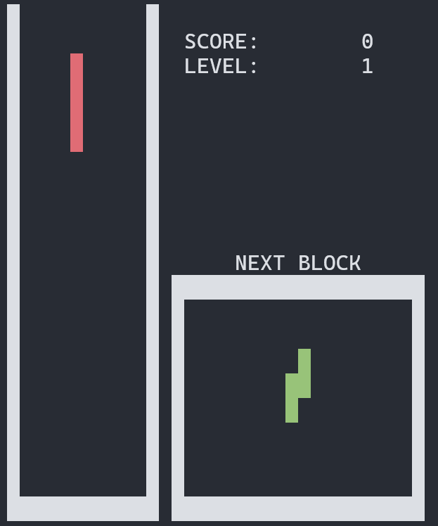

# BrickGame Тетрис

Реализация игры «Тетрис» на языке программирования С с использованием структурного подхода.



## Build

```
$ make
```

## Запуск игры

```
$ ./game
```

## Tests

Unit-тесты реализованы при помощи билиотеки check.h, отчет о покрытии при помощи [LCOV](https://github.com/linux-test-project/lcov)

```
$ make test
```

Отчет о покрытии:

```
$ make gcov_report
```
