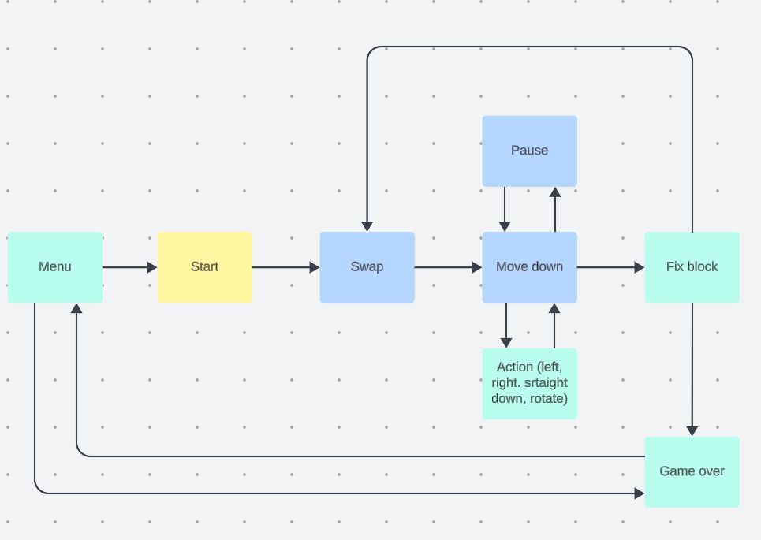
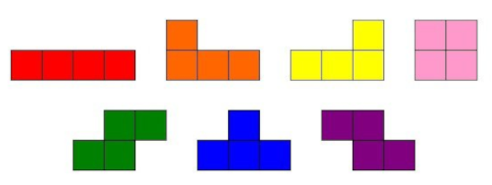

# Документацмя проекта Tetris

## Управление игрой

- Старт игры: клавиша 'enter'
- Движение фигуры: клавиши 'вниз', 'влево', 'вправо'
- Поворот фигуры: клавиша 'e'
- Пауза: клавиша 'p'
- Выход из игры: клавиша 'esc'

## Конечный автомат

Используемый конечный автомат (КА) в данном проекте:

Конечный автомат состои из модулей:

**Menu** - состояние, в котором игра ждет выбор пользователя начала игры либо ее окончания

**Start** - состояние, в котором игра ждет, пока игрок нажмет кнопку готовности к игре

**Spawn** - состояние, в которое переходит игра при создании очередного блока и выбора следующего блока для спавна.

**Moving** - основное игровое состояние с обработкой ввода от пользователя

**Action** - поворот блоков/перемещение блоков по горизонтали и ускоренное падение вниз

**Pause** - состояние паузы, с ожиданием ввода от пользователя для возобновления игры

**Fix block** - состояние, в которое преходит игра после «соприкосновения» текущего блока с уже упавшими или с землей. Если образуются заполненные линии, то она уничтожается и остальные блоки смещаются вниз. Если блок остановился в самом верхнем ряду, то игра переходит в состояние «игра окончена»

**Game Over** - игра окончена

## Логика игры

При запуске программы позьзователь может выбрать `"New game"` или `"Quit"` при помощи клавиш `UP` и `DOWN`, при нажатии `ENTER` в зависимости от выбранного пункта начало игры или выход из игры

Далее происходит инициализация структур `initializeGameInfo(gameInfo)` `UserAction_t action` далее в цикле `while` происходит реализация цикла игры до тех пор пока over!=0, считывая пользовательский ввод происходит реазизация двжиния фигуры либо изменения ее формы.

Функция `gameLogic` является основной в реализации фиксации фигуры на поле, где происходит проверка на нижнюю строку, и при ее заполненности фигура закрепляется на поле, и массив field заполняется в соответсвующих элементах.

Если при фиксации фигуры происхожит заполнение линий, при работе функции `checkforrows` происходит уничтожение линии, а также добавление очков и увеличение уровня.

- 1 линия - 100 очков;
- 2 линии - 300 очков;
- 3 линии - 700 очков;
- 4 линии - 1500 очков.

Если фигура при фиксации касается верхней линии игрового поля, то игра переходит в состояние over.

## Отрисовка поля

Поле шириной 10 и высотой 20. Массив сделан на 2 больше, ркраевые значения заполнены 9, чтобы отрисовать края: ` gameInfo->field[y][x] = (x == 0 || x == WIDTH - 1 || y == HEIGHT - 1) ? 9 : 0;`.

Цвета инициализируются в функции `WINDOW *get_main_window()`.

У каждой фигры есть свой номер цвета, фигуры в игру представленны ниже:

